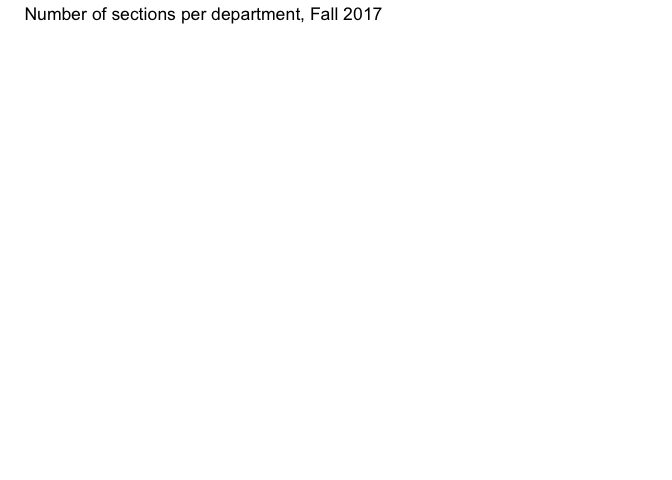

```r
library(tidyverse)     # for data cleaning and plotting
library(gardenR)       # for Lisa's garden data
library(lubridate)     # for date manipulation
library(openintro)     # for the abbr2state() function
library(palmerpenguins)# for Palmer penguin data
library(maps)          # for map data
library(ggmap)         # for mapping points on maps
library(gplots)        # for col2hex() function
library(RColorBrewer)  # for color palettes
library(sf)            # for working with spatial data
library(leaflet)       # for highly customizable mapping
library(ggthemes)      # for more themes (including theme_map())
library(plotly)        # for the ggplotly() - basic interactivity
library(gganimate)     # for adding animation layers to ggplots
library(gifski)        # for creating the gif (don't need to load this library every time,but need it installed)
library(transformr)    # for "tweening" (gganimate)
library(shiny)         # for creating interactive apps
library(patchwork)     # for nicely combining ggplot2 graphs  
library(gt)            # for creating nice tables
library(rvest)         # for scraping data
library(robotstxt)     # for checking if you can scrape data
library(geomtextpath)
theme_set(theme_minimal())
```


```r
# Lisa's garden data
data("garden_harvest")

#COVID-19 data from the New York Times
covid19 <- read_csv("https://raw.githubusercontent.com/nytimes/covid-19-data/master/us-states.csv")
```

## Put your homework on GitHub!

Go [here](https://github.com/llendway/github_for_collaboration/blob/master/github_for_collaboration.md) or to previous homework to remind yourself how to get set up. 

Once your repository is created, you should always open your **project** rather than just opening an .Rmd file. You can do that by either clicking on the .Rproj file in your repository folder on your computer. Or, by going to the upper right hand corner in R Studio and clicking the arrow next to where it says Project: (None). You should see your project come up in that list if you've used it recently. You could also go to File --> Open Project and navigate to your .Rproj file. 

## Instructions

* Put your name at the top of the document. 

* **For ALL graphs, you should include appropriate labels.** 

* Feel free to change the default theme, which I currently have set to `theme_minimal()`. 

* Use good coding practice. Read the short sections on good code with [pipes](https://style.tidyverse.org/pipes.html) and [ggplot2](https://style.tidyverse.org/ggplot2.html). **This is part of your grade!**

* **NEW!!** With animated graphs, add `eval=FALSE` to the code chunk that creates the animation and saves it using `anim_save()`. Add another code chunk to reread the gif back into the file. See the [tutorial](https://animation-and-interactivity-in-r.netlify.app/) for help. 

* When you are finished with ALL the exercises, uncomment the options at the top so your document looks nicer. Don't do it before then, or else you might miss some important warnings and messages.


## Warm-up exercises from tutorial

1. Read in the fake garden harvest data. Find the data [here](https://github.com/llendway/scraping_etc/blob/main/2020_harvest.csv) and click on the `Raw` button to get a direct link to the data. After reading in the data, do one of the quick checks mentioned in the tutorial.


```r
fake_garden_data <- read_csv("https://raw.githubusercontent.com/nytimes/covid-19-data/master/us-states.csv")
```
 
2. Read in this [data](https://www.kaggle.com/heeraldedhia/groceries-dataset) from the kaggle website. You will need to download the data first. Save it to your project/repo folder. Do some quick checks of the data to assure it has been read in appropriately.


```r
groceries <- read_csv("Groceries_dataset.csv")
```

3. Create a table using `gt` with data from your project or from the `garden_harvest` data if your project data aren't ready. Use at least 3 `gt()` functions.


```r
garden_table <- 
  garden_harvest %>%
  filter(vegetable == "radish") %>% 
  gt() %>% 
  fmt_date(
    columns = c(date),
    date_style = 6
  ) %>% 
  cols_hide(columns = c(variety)) %>% 
  tab_footnote(
    footnote = "Much cool. Very footnote.",
    locations = cells_body(
      columns = c(weight),
      rows = weight < 20
    )
  )

garden_table
```

```{=html}
<div id="vzhuctetlp" style="overflow-x:auto;overflow-y:auto;width:auto;height:auto;">
<style>html {
  font-family: -apple-system, BlinkMacSystemFont, 'Segoe UI', Roboto, Oxygen, Ubuntu, Cantarell, 'Helvetica Neue', 'Fira Sans', 'Droid Sans', Arial, sans-serif;
}

#vzhuctetlp .gt_table {
  display: table;
  border-collapse: collapse;
  margin-left: auto;
  margin-right: auto;
  color: #333333;
  font-size: 16px;
  font-weight: normal;
  font-style: normal;
  background-color: #FFFFFF;
  width: auto;
  border-top-style: solid;
  border-top-width: 2px;
  border-top-color: #A8A8A8;
  border-right-style: none;
  border-right-width: 2px;
  border-right-color: #D3D3D3;
  border-bottom-style: solid;
  border-bottom-width: 2px;
  border-bottom-color: #A8A8A8;
  border-left-style: none;
  border-left-width: 2px;
  border-left-color: #D3D3D3;
}

#vzhuctetlp .gt_heading {
  background-color: #FFFFFF;
  text-align: center;
  border-bottom-color: #FFFFFF;
  border-left-style: none;
  border-left-width: 1px;
  border-left-color: #D3D3D3;
  border-right-style: none;
  border-right-width: 1px;
  border-right-color: #D3D3D3;
}

#vzhuctetlp .gt_title {
  color: #333333;
  font-size: 125%;
  font-weight: initial;
  padding-top: 4px;
  padding-bottom: 4px;
  padding-left: 5px;
  padding-right: 5px;
  border-bottom-color: #FFFFFF;
  border-bottom-width: 0;
}

#vzhuctetlp .gt_subtitle {
  color: #333333;
  font-size: 85%;
  font-weight: initial;
  padding-top: 0;
  padding-bottom: 6px;
  padding-left: 5px;
  padding-right: 5px;
  border-top-color: #FFFFFF;
  border-top-width: 0;
}

#vzhuctetlp .gt_bottom_border {
  border-bottom-style: solid;
  border-bottom-width: 2px;
  border-bottom-color: #D3D3D3;
}

#vzhuctetlp .gt_col_headings {
  border-top-style: solid;
  border-top-width: 2px;
  border-top-color: #D3D3D3;
  border-bottom-style: solid;
  border-bottom-width: 2px;
  border-bottom-color: #D3D3D3;
  border-left-style: none;
  border-left-width: 1px;
  border-left-color: #D3D3D3;
  border-right-style: none;
  border-right-width: 1px;
  border-right-color: #D3D3D3;
}

#vzhuctetlp .gt_col_heading {
  color: #333333;
  background-color: #FFFFFF;
  font-size: 100%;
  font-weight: normal;
  text-transform: inherit;
  border-left-style: none;
  border-left-width: 1px;
  border-left-color: #D3D3D3;
  border-right-style: none;
  border-right-width: 1px;
  border-right-color: #D3D3D3;
  vertical-align: bottom;
  padding-top: 5px;
  padding-bottom: 6px;
  padding-left: 5px;
  padding-right: 5px;
  overflow-x: hidden;
}

#vzhuctetlp .gt_column_spanner_outer {
  color: #333333;
  background-color: #FFFFFF;
  font-size: 100%;
  font-weight: normal;
  text-transform: inherit;
  padding-top: 0;
  padding-bottom: 0;
  padding-left: 4px;
  padding-right: 4px;
}

#vzhuctetlp .gt_column_spanner_outer:first-child {
  padding-left: 0;
}

#vzhuctetlp .gt_column_spanner_outer:last-child {
  padding-right: 0;
}

#vzhuctetlp .gt_column_spanner {
  border-bottom-style: solid;
  border-bottom-width: 2px;
  border-bottom-color: #D3D3D3;
  vertical-align: bottom;
  padding-top: 5px;
  padding-bottom: 5px;
  overflow-x: hidden;
  display: inline-block;
  width: 100%;
}

#vzhuctetlp .gt_group_heading {
  padding-top: 8px;
  padding-bottom: 8px;
  padding-left: 5px;
  padding-right: 5px;
  color: #333333;
  background-color: #FFFFFF;
  font-size: 100%;
  font-weight: initial;
  text-transform: inherit;
  border-top-style: solid;
  border-top-width: 2px;
  border-top-color: #D3D3D3;
  border-bottom-style: solid;
  border-bottom-width: 2px;
  border-bottom-color: #D3D3D3;
  border-left-style: none;
  border-left-width: 1px;
  border-left-color: #D3D3D3;
  border-right-style: none;
  border-right-width: 1px;
  border-right-color: #D3D3D3;
  vertical-align: middle;
}

#vzhuctetlp .gt_empty_group_heading {
  padding: 0.5px;
  color: #333333;
  background-color: #FFFFFF;
  font-size: 100%;
  font-weight: initial;
  border-top-style: solid;
  border-top-width: 2px;
  border-top-color: #D3D3D3;
  border-bottom-style: solid;
  border-bottom-width: 2px;
  border-bottom-color: #D3D3D3;
  vertical-align: middle;
}

#vzhuctetlp .gt_from_md > :first-child {
  margin-top: 0;
}

#vzhuctetlp .gt_from_md > :last-child {
  margin-bottom: 0;
}

#vzhuctetlp .gt_row {
  padding-top: 8px;
  padding-bottom: 8px;
  padding-left: 5px;
  padding-right: 5px;
  margin: 10px;
  border-top-style: solid;
  border-top-width: 1px;
  border-top-color: #D3D3D3;
  border-left-style: none;
  border-left-width: 1px;
  border-left-color: #D3D3D3;
  border-right-style: none;
  border-right-width: 1px;
  border-right-color: #D3D3D3;
  vertical-align: middle;
  overflow-x: hidden;
}

#vzhuctetlp .gt_stub {
  color: #333333;
  background-color: #FFFFFF;
  font-size: 100%;
  font-weight: initial;
  text-transform: inherit;
  border-right-style: solid;
  border-right-width: 2px;
  border-right-color: #D3D3D3;
  padding-left: 5px;
  padding-right: 5px;
}

#vzhuctetlp .gt_stub_row_group {
  color: #333333;
  background-color: #FFFFFF;
  font-size: 100%;
  font-weight: initial;
  text-transform: inherit;
  border-right-style: solid;
  border-right-width: 2px;
  border-right-color: #D3D3D3;
  padding-left: 5px;
  padding-right: 5px;
  vertical-align: top;
}

#vzhuctetlp .gt_row_group_first td {
  border-top-width: 2px;
}

#vzhuctetlp .gt_summary_row {
  color: #333333;
  background-color: #FFFFFF;
  text-transform: inherit;
  padding-top: 8px;
  padding-bottom: 8px;
  padding-left: 5px;
  padding-right: 5px;
}

#vzhuctetlp .gt_first_summary_row {
  border-top-style: solid;
  border-top-color: #D3D3D3;
}

#vzhuctetlp .gt_first_summary_row.thick {
  border-top-width: 2px;
}

#vzhuctetlp .gt_last_summary_row {
  padding-top: 8px;
  padding-bottom: 8px;
  padding-left: 5px;
  padding-right: 5px;
  border-bottom-style: solid;
  border-bottom-width: 2px;
  border-bottom-color: #D3D3D3;
}

#vzhuctetlp .gt_grand_summary_row {
  color: #333333;
  background-color: #FFFFFF;
  text-transform: inherit;
  padding-top: 8px;
  padding-bottom: 8px;
  padding-left: 5px;
  padding-right: 5px;
}

#vzhuctetlp .gt_first_grand_summary_row {
  padding-top: 8px;
  padding-bottom: 8px;
  padding-left: 5px;
  padding-right: 5px;
  border-top-style: double;
  border-top-width: 6px;
  border-top-color: #D3D3D3;
}

#vzhuctetlp .gt_striped {
  background-color: rgba(128, 128, 128, 0.05);
}

#vzhuctetlp .gt_table_body {
  border-top-style: solid;
  border-top-width: 2px;
  border-top-color: #D3D3D3;
  border-bottom-style: solid;
  border-bottom-width: 2px;
  border-bottom-color: #D3D3D3;
}

#vzhuctetlp .gt_footnotes {
  color: #333333;
  background-color: #FFFFFF;
  border-bottom-style: none;
  border-bottom-width: 2px;
  border-bottom-color: #D3D3D3;
  border-left-style: none;
  border-left-width: 2px;
  border-left-color: #D3D3D3;
  border-right-style: none;
  border-right-width: 2px;
  border-right-color: #D3D3D3;
}

#vzhuctetlp .gt_footnote {
  margin: 0px;
  font-size: 90%;
  padding-left: 4px;
  padding-right: 4px;
  padding-left: 5px;
  padding-right: 5px;
}

#vzhuctetlp .gt_sourcenotes {
  color: #333333;
  background-color: #FFFFFF;
  border-bottom-style: none;
  border-bottom-width: 2px;
  border-bottom-color: #D3D3D3;
  border-left-style: none;
  border-left-width: 2px;
  border-left-color: #D3D3D3;
  border-right-style: none;
  border-right-width: 2px;
  border-right-color: #D3D3D3;
}

#vzhuctetlp .gt_sourcenote {
  font-size: 90%;
  padding-top: 4px;
  padding-bottom: 4px;
  padding-left: 5px;
  padding-right: 5px;
}

#vzhuctetlp .gt_left {
  text-align: left;
}

#vzhuctetlp .gt_center {
  text-align: center;
}

#vzhuctetlp .gt_right {
  text-align: right;
  font-variant-numeric: tabular-nums;
}

#vzhuctetlp .gt_font_normal {
  font-weight: normal;
}

#vzhuctetlp .gt_font_bold {
  font-weight: bold;
}

#vzhuctetlp .gt_font_italic {
  font-style: italic;
}

#vzhuctetlp .gt_super {
  font-size: 65%;
}

#vzhuctetlp .gt_footnote_marks {
  font-style: italic;
  font-weight: normal;
  font-size: 75%;
  vertical-align: 0.4em;
}

#vzhuctetlp .gt_asterisk {
  font-size: 100%;
  vertical-align: 0;
}

#vzhuctetlp .gt_slash_mark {
  font-size: 0.7em;
  line-height: 0.7em;
  vertical-align: 0.15em;
}

#vzhuctetlp .gt_fraction_numerator {
  font-size: 0.6em;
  line-height: 0.6em;
  vertical-align: 0.45em;
}

#vzhuctetlp .gt_fraction_denominator {
  font-size: 0.6em;
  line-height: 0.6em;
  vertical-align: -0.05em;
}
</style>
<table class="gt_table">
  
  <thead class="gt_col_headings">
    <tr>
      <th class="gt_col_heading gt_columns_bottom_border gt_left" rowspan="1" colspan="1">vegetable</th>
      <th class="gt_col_heading gt_columns_bottom_border gt_left" rowspan="1" colspan="1">date</th>
      <th class="gt_col_heading gt_columns_bottom_border gt_right" rowspan="1" colspan="1">weight</th>
      <th class="gt_col_heading gt_columns_bottom_border gt_left" rowspan="1" colspan="1">units</th>
    </tr>
  </thead>
  <tbody class="gt_table_body">
    <tr><td class="gt_row gt_left">radish</td>
<td class="gt_row gt_left">Jun 6, 2020</td>
<td class="gt_row gt_right">36</td>
<td class="gt_row gt_left">grams</td></tr>
    <tr><td class="gt_row gt_left">radish</td>
<td class="gt_row gt_left">Jun 11, 2020</td>
<td class="gt_row gt_right">67</td>
<td class="gt_row gt_left">grams</td></tr>
    <tr><td class="gt_row gt_left">radish</td>
<td class="gt_row gt_left">Jun 13, 2020</td>
<td class="gt_row gt_right">53</td>
<td class="gt_row gt_left">grams</td></tr>
    <tr><td class="gt_row gt_left">radish</td>
<td class="gt_row gt_left">Jun 20, 2020</td>
<td class="gt_row gt_right">16<sup class="gt_footnote_marks">1</sup></td>
<td class="gt_row gt_left">grams</td></tr>
    <tr><td class="gt_row gt_left">radish</td>
<td class="gt_row gt_left">Jun 21, 2020</td>
<td class="gt_row gt_right">37</td>
<td class="gt_row gt_left">grams</td></tr>
    <tr><td class="gt_row gt_left">radish</td>
<td class="gt_row gt_left">Jul 3, 2020</td>
<td class="gt_row gt_right">88</td>
<td class="gt_row gt_left">grams</td></tr>
    <tr><td class="gt_row gt_left">radish</td>
<td class="gt_row gt_left">Jul 7, 2020</td>
<td class="gt_row gt_right">43</td>
<td class="gt_row gt_left">grams</td></tr>
    <tr><td class="gt_row gt_left">radish</td>
<td class="gt_row gt_left">Jul 13, 2020</td>
<td class="gt_row gt_right">50</td>
<td class="gt_row gt_left">grams</td></tr>
    <tr><td class="gt_row gt_left">radish</td>
<td class="gt_row gt_left">Jul 27, 2020</td>
<td class="gt_row gt_right">39</td>
<td class="gt_row gt_left">grams</td></tr>
  </tbody>
  
  <tfoot class="gt_footnotes">
    <tr>
      <td class="gt_footnote" colspan="4"><sup class="gt_footnote_marks">1</sup> Much cool. Very footnote.</td>
    </tr>
  </tfoot>
</table>
</div>
```

4. CHALLENGE (not graded): Write code to replicate the table shown below (open the .html file to see it) created from the `garden_harvest` data as best as you can. When you get to coloring the cells, I used the following line of code for the `colors` argument:
  

```r
colors = scales::col_numeric(
      palette = paletteer::paletteer_d(
        palette = "RColorBrewer::YlGn"
      ) %>% as.character()
```


  
5. Use `patchwork` operators and functions to combine at least two graphs using your project data or `garden_harvest` data if your project data aren't read.


```r
cancer <- readr::read_csv('total-cancer-deaths-by-type.csv')
```


```r
cancer <- cancer %>% 
  pivot_longer(cols = starts_with("Death"),   #pivot longer to plot death counts over the years
               names_to = "Type_of_cancer",
               values_to = "Death_count") %>% 
  mutate(Cancer_type = str_sub(Type_of_cancer, 10, -37)) %>%  #fixing the names of cancer
  select(-Type_of_cancer) 
```


```r
c1 <- cancer %>% 
  filter(Code == "USA") %>% 
  filter(Year == "1990") %>% 
  ggplot(aes(x = Death_count, y = reorder(Cancer_type, Death_count))) +
  geom_bar(stat = "identity") +
  labs(x = "",y = "",title = "Number of Cancer Deaths in the US in 1990 by Type of Cancer")
```


```r
c2 <- cancer %>% 
  filter(Code == "USA") %>% 
  filter(Death_count >= 25000) %>% 
  ggplot(aes(x = Year, y = Death_count, color = Cancer_type, label = Cancer_type)) +
  geom_labelline(straight = TRUE, size = 3, ) +
  labs(x = "",y = "",title = "Number of Cancer Deaths in the US from 1990-2019 by Type of Cancer") +
  theme(legend.position = "none")
```
 

```r
c1/c2
```


 
## Webscraping exercise (also from tutorial)

Use the data from the [Macalester Registrar's Fall 2017 Class Schedule](https://www.macalester.edu/registrar/schedules/2017fall/class-schedule/#crs10008) to complete all these exercises.


```r
robotstxt::paths_allowed(paths = "https://www.macalester.edu/registrar/schedules/2017fall/class-schedule/#crs10008")
```

```
## [1] TRUE
```


```r
fall2017 <- read_html("https://www.macalester.edu/registrar/schedules/2017fall/class-schedule/#crs10008")
```

6. Find the correct selectors for the following fields. Make sure that each matches 762 results:

  * Course Number
  * Course Name
  * Day
  * Time
  * Room
  * Instructor
  * Avail. / Max
  * General Education Requirements (make sure you only match 762; beware of the Mac copyright banner at the bottom of the page!)
  * Description


```r
course_number <- fall2017 %>%
  html_elements(".class-schedule-course-number") %>%
  html_text2()

course_name <- fall2017 %>%
  html_elements(".class-schedule-course-title") %>%
  html_text2()

course_days <- fall2017 %>%
  html_elements(".class-schedule-course-title+ .class-schedule-label") %>%
  html_text2() %>% 
  str_sub(start = 7)

course_time <- fall2017 %>%
  html_elements(".class-schedule-label:nth-child(4)") %>%
  html_text2() %>% 
  str_sub(start = 7)

course_room <- fall2017 %>%
  html_elements(".class-schedule-label:nth-child(5)") %>%
  html_text2() %>% 
  str_sub(start = 7)

course_instructor <- fall2017 %>%
  html_elements(".class-schedule-label:nth-child(6)") %>%
  html_text2() %>% 
  str_sub(start = 13)

course_availability <- fall2017 %>%
  html_elements(".class-schedule-label:nth-child(7)") %>%
  html_text2() %>% 
  str_sub(start = 14)

course_gen_ed_requirements <- fall2017 %>%
  html_elements("#content p:nth-child(2)") %>%
  html_text2()

course_description <- fall2017 %>%
  html_elements(".collapsed p:nth-child(1)") %>%
  html_text2() %>% 
  str_sub(start = 3, end = -2)
```

Then, put all this information into one dataset (tibble or data.frame) Do not include any extraneous information like "Instructor: ".


```r
courses_2017 <- tibble(
  number = course_number,
  name = course_name,
  days = course_days,
  time = course_time,
  room = course_room,
  instructor = course_instructor,
  availabity = course_availability,
  requirements = course_gen_ed_requirements,
  description = course_description
)
```
  

7. Create a graph that shows the number of sections offered per department. Hint: The department is a substring of the course number - there are `str_XXX()` functions that can help. Yes, COMP and MATH are the same department, but for this exercise you can just show the results by four letter department code, e.g., with COMP and MATH separate.


```r
courses_2017 %>%
  separate(number, into = c("dept", "num")) %>%
  ggplot(aes(y = dept)) + 
  geom_bar() + 
  scale_x_continuous(expand = c(0,0),
                     breaks = seq(0, 70, 10)) +
  labs(title = "Number of sections per department, Fall 2017",
       x = "",
       y = "")
```

<!-- -->

8. Analyze the typical length of course names by department. To do so, create a new data table based on your courses data table, with the following changes:
  
  * New columns for the length of the title of a course and the length of the description of the course. Hint: `str_length`.  
  * Remove departments that have fewer than 10 sections of courses. To do so, group by department, then remove observations in groups with fewer than 10 sections (Hint: use filter with n()). Then `ungroup()` the data.  
  * Create a visualization of the differences across groups in lengths of course names or course descriptions. Think carefully about the visualization you should be using!


```r
large_dept <-
  enhanced_course_df %>%  
  separate(number, into = c("dept", "num")) %>%
  mutate(name_length=str_length(name), 
         description_length=str_length(description)) %>%
  group_by(dept) %>%
  filter(n() > 10) %>%
  ungroup()
```

```
## Error in separate(., number, into = c("dept", "num")): object 'enhanced_course_df' not found
```

```r
large_dept %>% 
  ggplot(aes(y = dept, 
             x = name_length)) + 
  geom_boxplot() + 
  labs(title = "Distribution of course name lengths by department",
       y = NULL,
       x = NULL)
```

```
## Error in ggplot(., aes(y = dept, x = name_length)): object 'large_dept' not found
```

**DID YOU REMEMBER TO UNCOMMENT THE OPTIONS AT THE TOP?**

Github link: https://github.com/thuang111/ting_exercise_6
